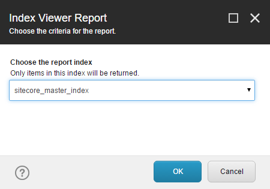
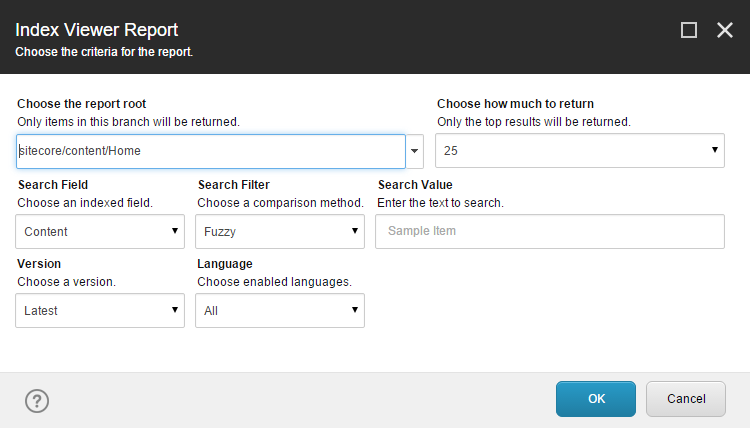

# Authoring Reports

Building reports is a straightforward task. We've provided a variety of examples for you to model when designing your own. 

### Dynamic Reports

The **Authorable Reports** module includes reports such as *Index Viewer* and *Rules based report* that provide input dialogs to help make the reports dynamic. 

#### Index Viewer
The *Index Viewer* report provides a great example at how to build a generic report that queries against the Sitecore index. By navigating to *Sitecore -> Toolbox -> Index Viewer* you can conveniently launch the report.

First you will be prompted with a dialog to select the index to search.



Next you will be prompted with a variety of buttons and knobs to narrow down the search results.



Finally the report is shown. Each row has an option to show more field results.


The *Show Full Info* link will then returns the additional fields not shown in the report.


The **Authorable Reports** module has a few points of interest.

* The script library *Internal/List View/Ribbon/SearchResultItem* instructs the report to show the action scripts when the row contains an entry with the typename *SearchResultItem*.
* The script library *Toolbox/Index Viewer* represents the shortcut.


**Examples:**
* [Creating Beautiful Sitecore Reports Easily with PowerShell Extensions][6]
* [Turn Your Sitecore Powershell Reports into Applications with Action Scripts][3]


### Static Reports

The **Content Reports** module includes other reports used for auditing. Below are some examples on how to create your own.

**Examples:**
 * [Images with an empty alt field][1]
 * [Unused media items][2]

### Interacting with Reports

#### Exports

#### Filter

#### Paging

#### Actions

#### UI Elements

The `Show-ListView` command provides the *Hide* parameter to control visibility of the UI elements.

Add parameter `-Hide` with one or more of the following options:
* `AllExport` - hides all export scripts (left-most ribbon panel)
* `NonSpecificExport` - hides export filters that are not specific to this view as specified by `-ViewName` (left-most ribbon panel)
* `Filter` - hides filter panel
* `PagingWhenNotNeeded` - hides paging when list is shorter than the page specified
* `AllActions` - hides all actions (right-most ribbon panel)
* `NonSpecificActions` - hides actions that are not specific to this view as specified by `-ViewName`  (right-most ribbon panel)
* `StatusBar` - hides status bar.

**Example:** The following example all of the UI elements in the report.
```powershell
Get-ChildItem master:\ | 
    Show-ListView `
        -Hide AllActions, AllExport, Filter, PagingWhenNotNeeded, StatusBar `
        -Property Name, DisplayName, ProviderPath, __Updated, "__Updated By"
```


### Examples from the community!

[Active Commerce][5] for Sitecore product has published reports on Github that you can checkout [here][4].
 


[1]: http://sitecorejunkie.com/2014/05/28/create-a-custom-report-in-sitecore-powershell-extensions
[2]: http://michaellwest.blogspot.com/2014/04/reports-with-sitecore-powershell.html
[3]: http://blog.najmanowicz.com/2015/05/05/turn-your-sitecore-powershell-reports-into-applications-with-action-scripts/
[4]: https://github.com/ActiveCommerce/activecommerce-powershell-extensions
[5]: http://www.activecommerce.com/
[6]: http://blog.najmanowicz.com/2014/10/25/creating-beautiful-sitecore-reports-easily-with-powershell-extensions/
