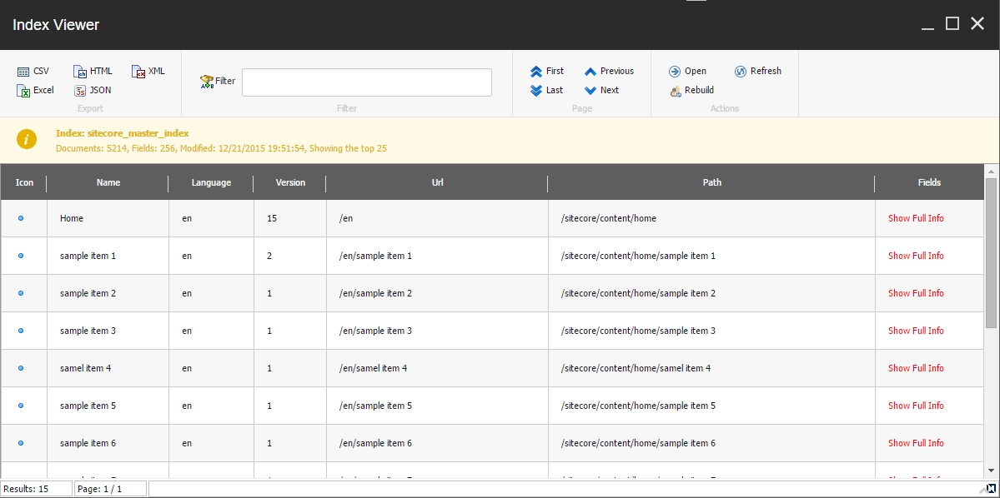
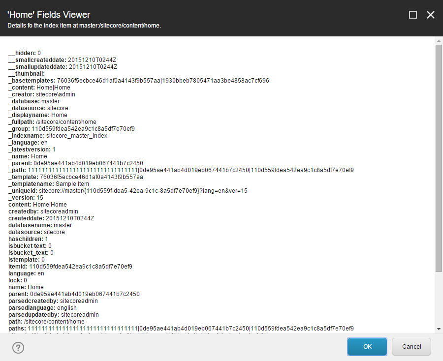
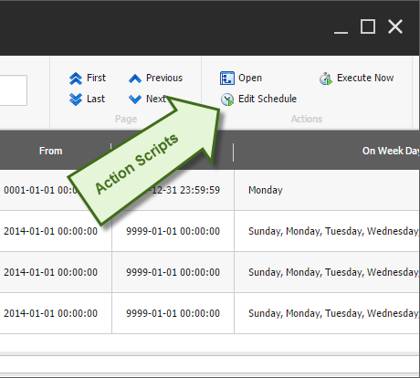
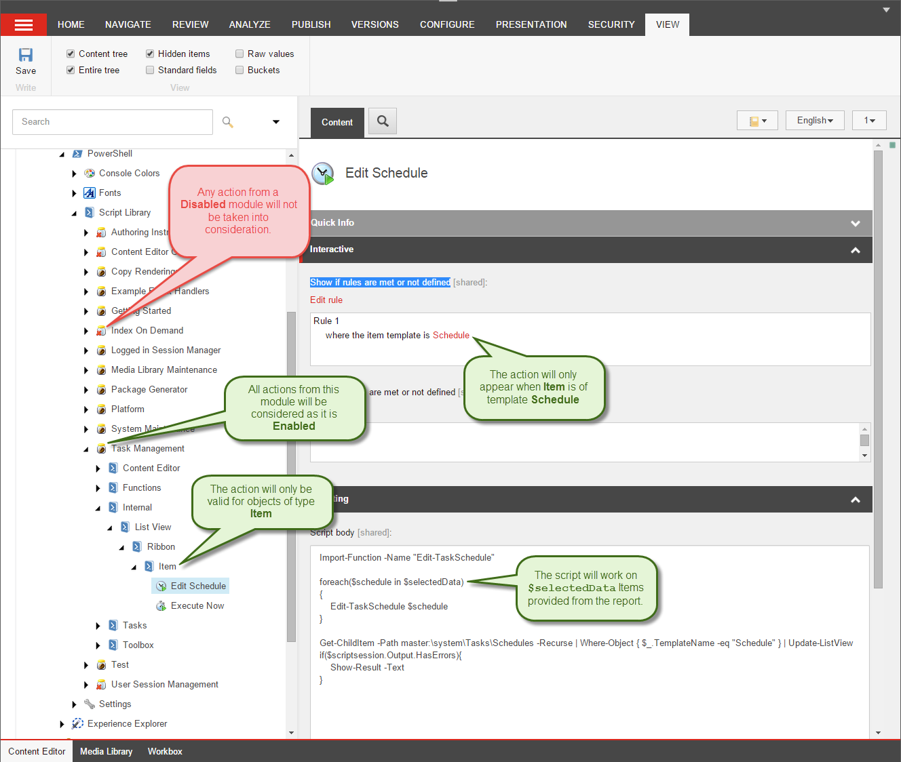

# Authoring Reports

Building reports is a straightforward task. We've provided a variety of examples for you to model when designing your own. 

### Dynamic Reports

The **Authorable Reports** module includes reports such as *Index Viewer* and *Rules based report* that provide input dialogs to help make the reports dynamic. 

#### Index Viewer
The *Index Viewer* report provides a great example at how to build a generic report that queries against the Sitecore index. By navigating to *Sitecore -> Toolbox -> Index Viewer* you can conveniently launch the report.

First you will be prompted with a dialog to select the index to search.


Next you will be prompted with a variety of buttons and knobs to narrow down the search results.


Finally the report is shown. Each row has an option to show more field results.



The *Show Full Info* link will then returns the additional fields not shown in the report.



The **Authorable Reports** module has a few points of interest.

* The script library *Internal/List View/Ribbon/SearchResultItem* instructs the report to show the action scripts when the row contains an entry with the typename *SearchResultItem*.
* The script library *Toolbox/Index Viewer* represents the shortcut.


**Examples:**
* [Creating Beautiful Sitecore Reports Easily with PowerShell Extensions][6]
* [Turn Your Sitecore Powershell Reports into Applications with Action Scripts][3]


### Static Reports

The **Content Reports** module includes other reports used for auditing. Below are some examples on how to create your own.

**Examples:**
 * [Images with an empty alt field][1]
 * [Unused media items][2]

### Interacting with Reports

#### Exports

#### Filter

#### Paging

#### Actions

Actions are simply commands powered by scripts and with visibility dependent on certain conditions like the .Net class of the object that is displayed or perhaps other session settings.



You define an action as a script located in an SPE script library and appears in the Actions panel. In the simplest scenario the action would appear when the script library name matches the .Net class name of the items displayed. In the above scenario the actions are placed under `/Platform/Internal/List View/Ribbon/Item/` where *Platform* is the module and *Item* is a script library. Let's take a look at the script here `/Platform/Internal/List View/Ribbon/Item/Open`

```powershell
foreach($item in $selectedData){
# Run Sheer application on Desktop
Show-Application `
    -Application "Content Editor" `
    -Parameter @{id ="$($item.ID)"; fo="$($item.ID)"; 
                 la="$($item.Language.Name)"; vs="$($item.Version.Number)";
                 sc_content="$($item.Database.Name)"}
}
```

The variable `$selectedData` is provided to the script automatically by SPE in context of the content of the results on `Show-ListView`.

##### What input is passed to an action script?

When your action script is executed the environment is initialized with a number of variables at your disposal as seen below:

* `$selectedData` – the selected objects in the list view (the same will be passed to the `$resultSet` variable for compatibility with older scripts)
* `$allData` – all objects passed to the list view using the `-Data` parameter.
* `$filteredData` – all objects displayed after filtering is performed with the search criteria entered by the user in the ribbon.
* `$exportData` – same as `$filteredData`, however in this case the objects will have additional properties to support easy display with properties processed as text.
* `$actionData` – any object that was passed to `Show-ListView` using the `-ActionData` parameter. Useful when you need additional context that the `Show-ListView` command does not explicitly know about. It’s your custom data.
* `$formatProperty` – the content of the `–Property` parameter when running the command.
* `$title` – window title of the list view.
* `$infoTitle` – info title of the list view.
* `$infoDescription` – info title of the list view.

Consequently you get the full state of the report the user sees in the UI and you can act upon it.

##### How the report determines if your action is visible?
You can have multiple actions defined with dynamic visibility. The actions are generally only relevant in the context of your report. This is done on two levels. The first level happens based on the location of the script and .Net object type you are displaying in the report. The second level is based on Sitecore rules. For the action to appear all of the following conditions must be met:

* All scripts visible in the report should be located in an enabled module.
* The action script should be within the path `/Internal/List View/Ribbon/[Object type]`. The `[Object type]` is the name of the .Net class for which the action is valid. For example, if you want your action to be visible for `Sitecore.Data.Items.Item` then save the script at the path `/Internal/List View/Ribbon/Item`.
* If the action script has no rules defined in the "Show if rules are met or not defined" field it will appear for all objects passed to `Show-ListView` that are of the type based on location. Rules will provide more granular control and allow for rule-based conditions that determine action visibility.

##### Using rules to control action visibility

Rules add the full power of the Sitecore rules engine – similarly to what you can do on context menu items or ribbon actions in Content Editor. Some examples where this can be useful include only enabling or disabling the action for items located under a specific branch of the tree or if a [persistent session][7] exists.

The following screenshot shows how to create an action that only appears in reports that list objects of type `Item` that are of template `Schedule`.



#### UI Elements

The `Show-ListView` command provides the *Hide* parameter to control visibility of the UI elements.

Add parameter `-Hide` with one or more of the following options:
* `AllExport` - hides all export scripts (left-most ribbon panel)
* `NonSpecificExport` - hides export filters that are not specific to this view as specified by `-ViewName` (left-most ribbon panel)
* `Filter` - hides filter panel
* `PagingWhenNotNeeded` - hides paging when list is shorter than the page specified
* `AllActions` - hides all actions (right-most ribbon panel)
* `NonSpecificActions` - hides actions that are not specific to this view as specified by `-ViewName`  (right-most ribbon panel)
* `StatusBar` - hides status bar.

**Example:** The following example all of the UI elements in the report.
```powershell
Get-ChildItem master:\ | 
    Show-ListView `
        -Hide AllActions, AllExport, Filter, PagingWhenNotNeeded, StatusBar `
        -Property Name, DisplayName, ProviderPath, __Updated, "__Updated By"
```


### Examples from the community!

[Active Commerce][5] for Sitecore product has published reports on Github that you can checkout [here][4].
 


[1]: http://sitecorejunkie.com/2014/05/28/create-a-custom-report-in-sitecore-powershell-extensions
[2]: http://michaellwest.blogspot.com/2014/04/reports-with-sitecore-powershell.html
[3]: http://blog.najmanowicz.com/2015/05/05/turn-your-sitecore-powershell-reports-into-applications-with-action-scripts/
[4]: https://github.com/ActiveCommerce/activecommerce-powershell-extensions
[5]: http://www.activecommerce.com/
[6]: http://blog.najmanowicz.com/2014/10/25/creating-beautiful-sitecore-reports-easily-with-powershell-extensions/
[7]: http://blog.najmanowicz.com/2014/10/26/sitecore-powershell-extensions-persistent-sessions/
