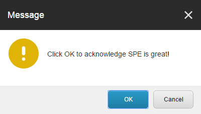
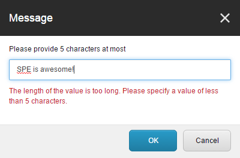
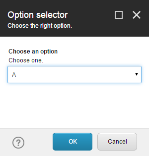
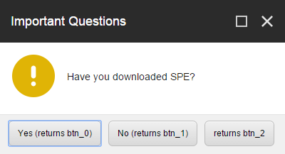
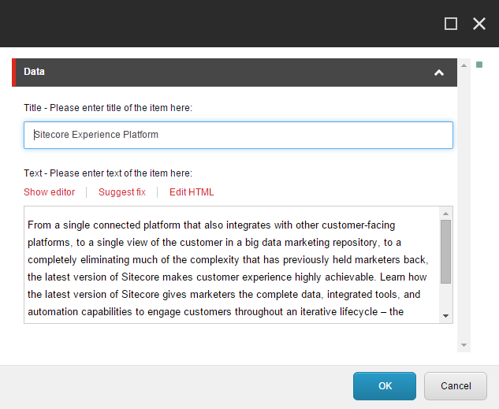
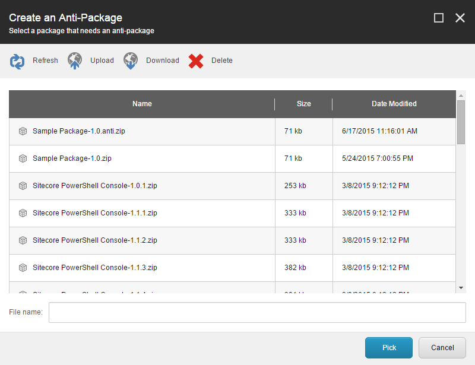
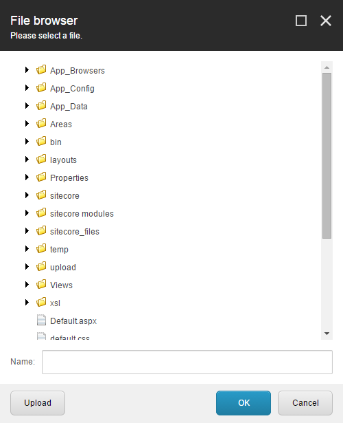
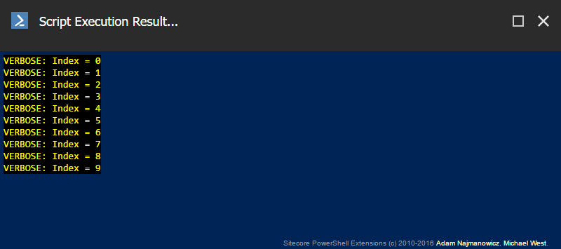

# Interactive Dialogs

We've provided a few commands to interact with the user through dialogs.

## Simple Dialogs

Simple in the sense that the dialogs present the user with a short message and one or two buttons.

### Alert

The *Alert* dialog is a way to notify the user of important information with an "OK" button.

**Example:** The following display a modal dialog.
```powershell
Show-Alert -Title "SPE is great!"
```

No return value.


### Confirmation

The *Confirmation* dialog is a way to verify with the user before proceeding.

**Example:** The following displays a modal dialog with an OK or Cancel confirmation.
```powershell
Show-Confirm -Title "Click OK to acknowledge SPE is great!"
```

| Button Name | Return Value |
| -- | -- |
| OK | yes |
| Cancel | no |



### User Input

**Example:** The following displays an input dialog for text.
```powershell
Show-Input "Please provide 5 characters at most" -MaxLength 5
```

| Button Name | Return Value |
| -- | -- |
| OK | < user input > |
| Cancel | $null |




## Advanced Dialogs

### Variable Settings

The `Read-Variable` command provides a way to prompt the user for information and then generate variables with those values.

**Example:** The following displays a dialog with a dropdown.

**Note:** The name *selectedOption* will result in a variable that contains the selected option.
```powershell
$options = @{
    "A"="a"
    "B"="b"
}

$props = @{
    Parameters = @(
        @{Name="selectedOption"; Title="Choose an option"; Options=$options; Tooltip="Choose one."}
    )
    Title = "Option selector"
    Description = "Choose the right option."
    Width = 300
    Height = 300
    ShowHints = $true
}

Read-Variable @props
```

| Button Name | Return Value |
| -- | -- |
| OK | ok |
| Cancel | cancel |
| < variables > | < selection > |



### Confirmation Choice

The *Confirmation Choice* dialog allows for multiple combinations like that seen with a "Yes, Yes to all, No, No to all" scenario.

**Example:** The following displays a modal dialog with choices.
```powershell
Show-ModalDialog -Control "ConfirmChoice" -Parameters @{btn_0="Yes (returns btn_0)"; btn_1="No (returns btn_1)"; btn_2="returns btn_2"; te="Have you downloaded SPE?"; cp="Important Questions"} -Height 120 -Width 400
```

**Note:** The hashtable keys should be incremented like *btn_0*, *btn_1*, and so on. The return value is the key name.

| Button Name | Return Value |
| -- | -- |
| < first button > | btn_0 |
| < second button > | btn_1 |
| < third button > | btn_2 |



### Upload

The *Upload* dialog provides a way to upload files from a local filesystem to the media library or server filesystem.

**Example:** The following displays an advanced upload dialog.
```powershell
Receive-File (Get-Item "master:\media library\Files") -AdvancedDialog
```
No return value.


### Download

The *Download* dialog provides a way to download files from the server to a local filesystem.

**Example:** The following displays a download dialog.
```powershell
Get-Item -Path "master:\media library\Files\readme" | Send-File
```


### Field Editor

The *Field Editor* dialog offers a convenient way to present the user with fields to edit.

**Example:** The following displays a field editor dialog.
```powershell
Get-Item "master:\content\home" | Show-FieldEditor -Name "*" -PreserveSections
```

| Button Name | Return Value |
| -- | -- |
| OK | ok |
| Cancel | cancel |



### File Browser

**Example:** The following displays a file browser dialog for installation packages.
```powershell
Show-ModalDialog -HandleParameters @{
    "h"="Create an Anti-Package"; 
    "t" = "Select a package that needs an anti-package"; 
    "ic"="People/16x16/box.png"; 
    "ok"="Pick";
    "ask"="";
    "path"= "packPath:$SitecorePackageFolder";
    "mask"="*.zip";
} -Control "Installer.Browse"
```

| Button Name | Return Value |
| -- | -- |
| OK | < selected file > |
| Cancel | undetermined |



**Example:** The following displays a simple file browser dialog.
```powershell
Show-ModalDialog -HandleParameters @{
    "h"="FileBrowser";
} -Control "FileBrowser" -Width 500
```

| Button Name | Return Value |
| -- | -- |
| OK | < selected file > |
| Cancel | undetermined |



**Example:** The following displays a Sheer UI control without any additional parameters.
```powershell
Show-ModalDialog -Control "ControlPanel"
```

### Data List

**Example:** The following displays a list view dialog with the child items under the Sitecore tree.
```powershell
Get-Item -Path master:\* | Show-ListView -Property Name, DisplayName, ProviderPath, TemplateName, Language
```


### Results

**Example:** The following displays a dialog with the all the information written to the ScriptSession output buffer.
```powershell
for($i = 0; $i -lt 10; $i++) {
    Write-Verbose "Index = $($i)" -Verbose
}

Show-Result -Text
```

