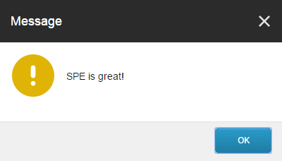
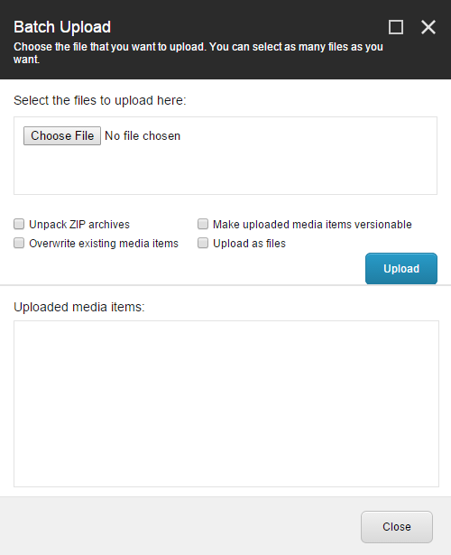
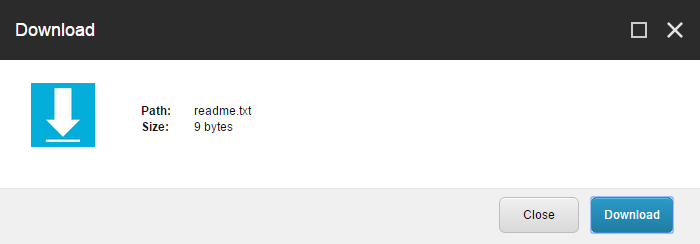
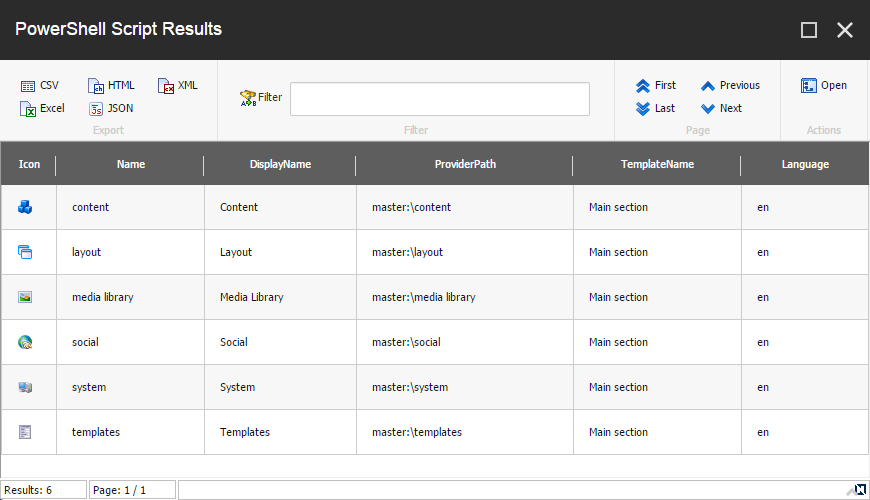

# Interactive Dialogs

We've provided a few commands to interact with the user through dialogs.

### Alert

**Example:** The following display a modal dialog.
```powershell
Show-Alert -Title "SPE is great!"
```

No return value.



### Variable Settings
Read-Variable

### Confirmation

**Example:** The following displays a modal dialog with an OK or Cancel confirmation.
```powershell
Show-Confirm -Title "Click OK to acknowledge SPE is great!"
```

| Button Name | Return Value |
| -- | -- |
| OK | yes |
| Cancel | no |


### Confirmation Choice

**Example:** The following displays a modal dialog with choices.
```powershell
Show-ModalDialog -Control "ConfirmChoice" -Parameters @{btn_0="Yes (returns btn_0)"; btn_1="No (returns btn_1)"; btn_2="returns btn_2"; te="Have you downloaded SPE?"; cp="Important Questions"} -Height 120 -Width 400
```

**Note:** The hashtable keys should be incremented like *btn_0*, *btn_1*, and so on. The return value is the key name.

| Button Name | Return Value |
| -- | -- |
| < first button > | btn_0 |
| < second button > | btn_1 |
| < third button > | btn_2 |


### Upload

**Example:** The following displays an advanced upload dialog.
```powershell
Receive-File (Get-Item "master:\media library\Files") -AdvancedDialog
```
No return value.



### Download

**Example:** The following displays a download dialog.
```powershell
Get-Item -Path "master:\media library\Files\readme" | Send-File
```



### Field Editor

**Example:** The following displays a field editor dialog.
```powershell
Get-Item "master:\content\home" | Show-FieldEditor -Name "*" -PreserveSections
```

| Button Name | Return Value |
| -- | -- |
| OK | ok |
| Cancel | cancel |


### User Input

**Example:** The following displays an input dialog for text.
```powershell
Show-Input "Please provide 5 characters at most" -MaxLength 5
```

| Button Name | Return Value |
| -- | -- |
| OK | < user input > |
| Cancel | $null |


### File Browser
Show-ModalDialog

### Data List

**Example:** The following displays a list view dialog with the child items under the Sitecore tree.
```powershell
Get-Item -Path master:\* | Show-ListView -Property Name, DisplayName, ProviderPath, TemplateName, Language
```



### Results
Show-Result

