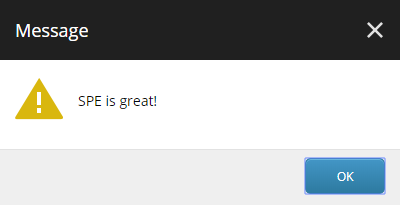
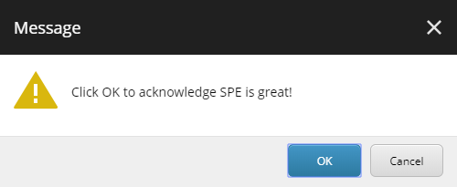
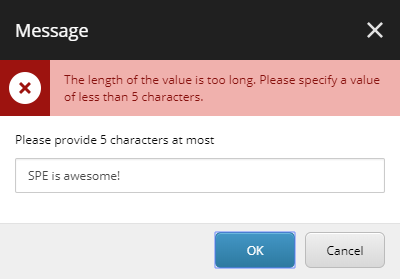
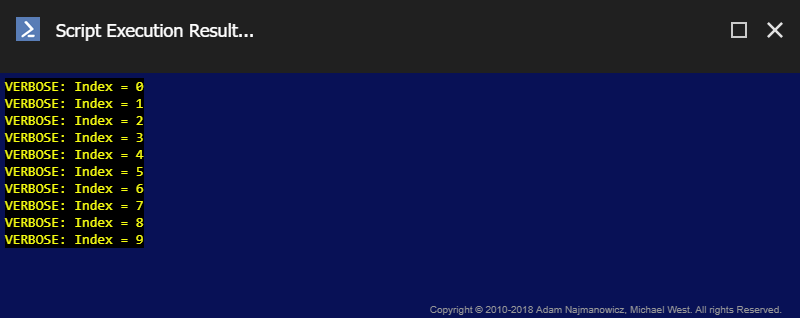

# Interactive Dialogs

We've provided a few commands to interact with the user through dialogs.

## Simple Dialogs

Simple in the sense that the dialogs present the user with a short message and one or two buttons.

### Alert

The _Alert_ dialog is a way to notify the user of important information with an "OK" button.

**Example:** The following display a modal dialog.

```text
Show-Alert -Title "SPE is great!"
```

No return value.



### Confirmation

The _Confirmation_ dialog is a way to verify with the user before proceeding.

**Example:** The following displays a modal dialog with an OK or Cancel confirmation.

```text
Show-Confirm -Title "Click OK to acknowledge SPE is great!"
```

| Button Name | Return Value |
| :--- | :--- |
| OK | yes |
| Cancel | no |



### User Input

**Example:** The following displays an input dialog for text.

```text
Show-Input "Please provide 5 characters at most" -MaxLength 5
```

| Button Name | Return Value |
| :--- | :--- |
| OK | &lt; user input &gt; |
| Cancel | $null |



**Example:** The following displays an input dialog with a error validation message.

```text
$inputProps = @{
    Prompt = "Enter a new name for the item:"
    Validation = [Sitecore.Configuration.Settings]::ItemNameValidation
    ErrorMessage = "'`$Input' is not a valid name."
    MaxLength = [Sitecore.Configuration.Settings]::MaxItemNameLength
}

Show-Input @inputProps
```


## Advanced Dialogs

### Variable Settings

The `Read-Variable` command provides a way to prompt the user for information and then generate variables with those values.

**Example:** The following displays a dialog with a dropdown.

**Note:** The name _selectedOption_ will result in a variable that contains the selected option.

```text
$options = @{
    "A"="a"
    "B"="b"
}

$props = @{
    Parameters = @(
        @{Name="selectedOption"; Title="Choose an option"; Options=$options; Tooltip="Choose one."}
    )
    Title = "Option selector"
    Description = "Choose the right option."
    Width = 300
    Height = 300
    ShowHints = $true
}

Read-Variable @props
```

| Button Name | Return Value |
| :--- | :--- |
| OK | ok |
| Cancel | cancel |
| &lt; variables &gt; | &lt; selection &gt; |


**Supported Parameter Values**

| Key | Type | Description | Example |
| :--- | :--- | :--- | :--- |
| Name | string | Variable name | isSilent |
| Value | bool string int float datetime Item | Default value | $true |
| Title | string | Header or Label | "Proceed Silently |
| Tooltip \(optional\) | string | Short description or tooltip | "Check to run quietly |
| Tab \(optional\) | string | Tab title | "Simple" |
| Placeholder \(optional\) | string | Textbox placeholder | "Search text..." |
| Lines \(optional\) | int | Line count | 3 |
| Editor \(optional\) | string | Control type | "date time" |
| Domain \(optional\) | string | Domain name for security editor | "sitecore" |
| Options \(optional\) | string OrderedDictionary Hashtable | Data for checklist or dropdown | @{"Monday"=1;"Tuesday"=2} |
| Columns | int string | Number between 1 and 12 and string 'first' or 'last' | 6 first |

**Editor Types**

* bool
* check
* date
* date time
* droplist
* droptree
* info
* multilist
* multilist search
* multiple user
* multiple user role
* multiple role
* radio
* rule
* rule action
* treelist
* time

### Confirmation Choice

The _Confirmation Choice_ dialog allows for multiple combinations like that seen with a "Yes, Yes to all, No, No to all" scenario.

**Example:** The following displays a modal dialog with choices.

```text
Show-ModalDialog -Control "ConfirmChoice" -Parameters @{btn_0="Yes - returns btn_0"; btn_1="No - returns btn_1"; btn_2="returns btn_2"; te="Have you downloaded SPE?"; cp="Important Questions"} -Height 120 -Width 650
```

**Note:** The hashtable keys should be incremented like _btn\_0_, _btn\_1_, and so on. The return value is the key name.

| Button Name | Return Value |
| :--- | :--- |
| &lt; first button &gt; | btn\_0 |
| &lt; second button &gt; | btn\_1 |
| &lt; third button &gt; | btn\_2 |


### Upload

The _Upload_ dialog provides a way to upload files from a local filesystem to the media library or server filesystem.

**Example:** The following displays an advanced upload dialog.

```text
Receive-File (Get-Item "master:\media library\Files") -AdvancedDialog
```

No return value.


### Download

The _Download_ dialog provides a way to download files from the server to a local filesystem.

**Example:** The following displays a download dialog.

```text
Get-Item -Path "master:\media library\Files\readme" | Send-File
```


### Field Editor

The _Field Editor_ dialog offers a convenient way to present the user with fields to edit.

**Example:** The following displays a field editor dialog.

```text
Get-Item "master:\content\home" | Show-FieldEditor -Name "*" -PreserveSections
```

| Button Name | Return Value |
| :--- | :--- |
| OK | ok |
| Cancel | cancel |


### File Browser

The _File Browser_ is an obvious choice when you need to upload, download, or delete files.

**Example:** The following displays a file browser dialog for installation packages.

```text
Show-ModalDialog -HandleParameters @{
    "h"="Create an Anti-Package"; 
    "t" = "Select a package that needs an anti-package"; 
    "ic"="People/16x16/box.png"; 
    "ok"="Pick";
    "ask"="";
    "path"= "packPath:$SitecorePackageFolder";
    "mask"="*.zip";
} -Control "Installer.Browse"
```

| Button Name | Return Value |
| :--- | :--- |
| OK | &lt; selected file &gt; |
| Cancel | undetermined |


**Example:** The following displays a simple file browser dialog.

```text
Show-ModalDialog -HandleParameters @{
    "h"="FileBrowser";
} -Control "FileBrowser" -Width 500
```

| Button Name | Return Value |
| :--- | :--- |
| OK | &lt; selected file &gt; |
| Cancel | undetermined |


**Example:** The following displays a Sheer UI control without any additional parameters.

```text
Show-ModalDialog -Control "ControlPanel"
```

### Data List

The "Data List" is essentially a report viewer which supports custom actions, exporting, and filtering.

**Example:** The following displays a list view dialog with the child items under the Sitecore tree.

```text
Get-Item -Path master:\* | Show-ListView -Property Name, DisplayName, ProviderPath, TemplateName, Language
```


### Results

The _Results_ dialog resembles the Console but does not provide a prompt to the user. This is useful for when logging messages.

**Example:** The following displays a dialog with the all the information written to the ScriptSession output buffer.

```text
for($i = 0; $i -lt 10; $i++) {
    Write-Verbose "Index = $($i)" -Verbose
}

Show-Result -Text
```



