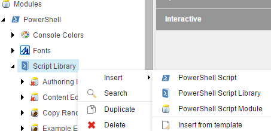

# Modules

Sitecore PowerShell Extensions provides a way to organize your scripts into _modules_.

Some benefits to using modules:

* The integration points contained within each module can be enabled or disabled globally. For this to take full affect the integration should be rebuilt in the ISE.
* Organization of custom scripts is a cinch.
* More reasons can be found in Adam's [post](https://github.com/SitecorePowerShell/Book/tree/9c7126d7a38df6ef372e8baef52f9a02baabd550/modules/[https:/blog.najmanowicz.com/2014/11/01/sitecore-powershell-extensions-3-0-modules-proposal/]/README.md).

**Note:** The _Platform_ module is one you should avoid changing.

## Create a custom module

Getting started with your own module is a short process and something you should do for all of your custom scripts.

1. Navigate to the _Script Library_ item and _Insert -&gt; PowerShell Script Module_.

   

2. Enter the name for the new module and click _OK_.
3. Right click the new module and _Scripts -&gt; Create libraries for integration points_.

   

4. Select the appropriate integration points for your module.

   

5. Select the module and enable for use.

   

6. Open the ISE, switch to the _Settings_ tab, and rebuild integrations.

