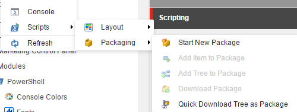
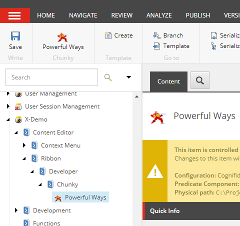
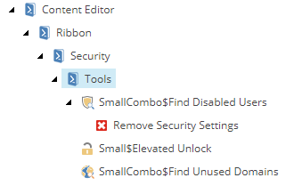
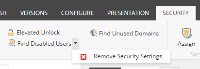

# Content Editor

## Context Menu

The _Context Menu_ integration allows for options in the context menu. Rules can be used to control visiblity and enablement. The script is only executed when the option is clicked.

1. Begin by adding a new script to the _Context Menu_ library. The name of the script will appear in the context menu.
2. Edit the script to perform the appropriate actions. The script can run in the background and show dialogs.
3. Change the icon of the item to match the script purpose.
4. Configure any rules as needed.

**Note:** Examples included in the following modules

* Authoring Instrumentation
* Copy Renderings
* Index On Demand
* Media Library Maintenance
* Package Generator

  

* Task Management

See how Adam added [context menu PowerShell scripts](https://blog.najmanowicz.com/2011/11/22/context-powershell-scripts-for-sitecore/).

## Gutter

The _Gutter_ integration allows for full flexibility of adding a gutter element.

1. Begin by adding a new script to the _Gutters_ library.
2. Edit the script to create a new instance of `Sitecore.Shell.Applications.ContentEditor.Gutters.GutterIconDescriptor` if the right conditions are met. 
   * Set the **Icon**, **Tooltip**, and **Click** properties.
   * Return the gutter object
3. Rebuild the gutter integration from within the ISE.
   * Settings tab
   * Integration chunk
   * Sync Library with Content Editor Gutter command

**Note:** Examples included in the following modules

* Publishing Status Gutter

  

## Insert Item

The _Insert Item_ integration allows for insert options in the context menu. Rules can be used to control visiblity and enablement. The script is only executed when the option is clicked.

1. Begin by adding a new script to the _Insert Item_ library. The name of the script will appear in the context menu.
2. Edit the script to perform the appropriate actions. The script can run in the background and show dialogs.
3. Change the icon of the item to match the script purpose.
4. Configure any rules as needed.

**Note:** Examples included in the following modules

* Task Management

  

* Platform

## Ribbon

The _Ribbon_ integration allows for commands in the ribbon. Rules can be used to control visiblity and enablement. The script is only executed when the option is clicked.

1. Begin by adding a new child script library to the _Ribbon_ library; we'll refer to this library as the **Tab** library. Choose a name such as _Home_ or _Developer_ \(this should match an existing tab name\).
2. Add a child script library to the **Tab** library; we'll call this the **Chunk** library. Choose a name such as _Edit_ or _Tools_. 
3. Add a new script to the **Chunk** script library; we'll refer to this library as the **Command** library. The name of the script will appear in the ribbon chunk as a command.
4. Edit the script to perform the appropriate actions. The script can run in the background and show dialogs.
5. Change the icon of the item to match the script purpose.
6. Configure any rules as needed.



\# Content Editor

**Example:** The following script gets the selected Context Menu item and displays an alert using the item name.

```powershell
# Use the notation "." to get the current directory/item.
$item = Get-Item -Path .
Show-Alert -Title $item.Name
```

**Button Size:**

There is a way to generate small buttons and combo buttons. You simply need to prefix the script name and SPE will generate accordingly.

* `Small$[SCRIPT_NAME]`
* `Combo$[SCRIPT_NAME]`
* `SmallCombo$[SCRIPT_NAME]`





See the birth of [extending the Sitecore ribbon with powershell scripts](https://blog.najmanowicz.com/2011/11/24/extending-sitecore-ribbon-with-powershell-scripts/) by Adam.

Check out an example of the [5 steps to extending the Sitecore ribbon](https://sitecoresandbox.com/2016/06/03/content-editor-ribbon-buttons-using-sitecore-powershell-extensions/) in the wild by Toby.

## Warning

The _Warning_ integration allows for notifications and commands in the Content Editor. Rules can be used to control visiblity and enablement. The scripts are only executed when the rule is met and the command is clicked.

1. Begin by adding a new script library to the _Warning_ library.
2. Edit the script to perform the appropriate actions. The script can run in the background and show dialogs.
3. The warning notification title, text and icon should be configured in the script.
   * Include options to the warning by adding one or more secondary scripts to the script library. 
4. Configure any rules as needed.

**Note:** Examples included in the following modules

* License Expiration - disabled by default


Alan provided a nice example [here][4] on setting up the warning with commands.

[4]: [https://alan-null.github.io/2016/04/content-editor-notifications](https://alan-null.github.io/2016/04/content-editor-notifications)

