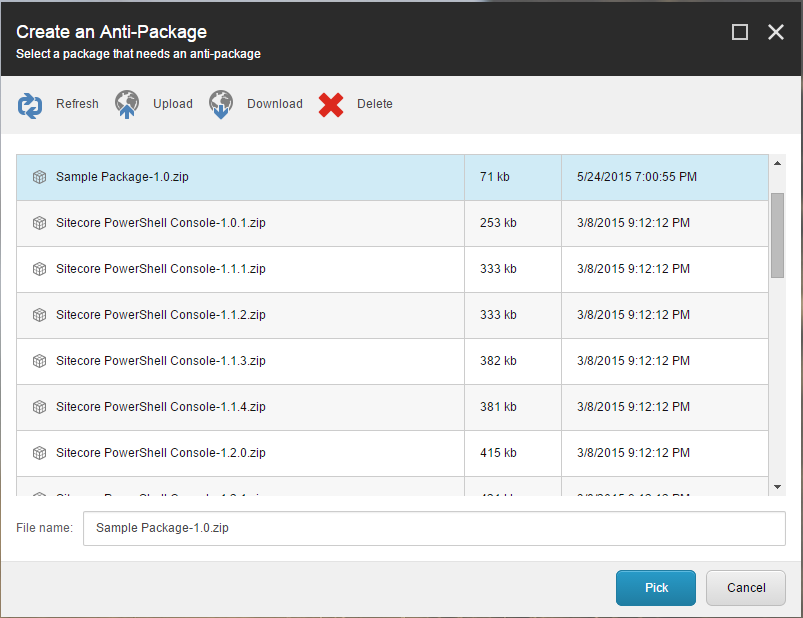

# Releases

## Version 3.1
It's already June and been way too long since I last sat down to collect my thoughts. The SPE team has been hard at work preparing for version 3.1 and we hope this version introduces many welcomed changes long overdue. I'll list a few of those below and explain a few important ones in this post. I ask that you provide any and all feedback either on twitter or github.

### New Features

- [337](https://github.com/SitecorePowerShell/Console/issues/337) Create anti-packages
- [374](https://github.com/SitecorePowerShell/Console/issues/374) Modal dialog with parameters
- [368](https://github.com/SitecorePowerShell/Console/issues/368) Content Editor Warning integration
- [364](https://github.com/SitecorePowerShell/Console/issues/364) Page Editor Notification integration
- [341](https://github.com/SitecorePowerShell/Console/issues/341) New-SecuritySource command for package creation
- [324](https://github.com/SitecorePowerShell/Console/issues/324) SPE Remoting module for use outside of Sitecore

### Enhancements

- [333](https://github.com/SitecorePowerShell/Console/issues/333) `Write-Log` now defaults to the **DEBUG** log
- [363](https://github.com/SitecorePowerShell/Console/issues/363) Script errors are now logged to the **ERROR** log, which will then show line numbers
- [339](https://github.com/SitecorePowerShell/Console/issues/339) `New-FileSource` and `New-ExplicitFileSource` commands support `InstallMode` for package creation
- [338](https://github.com/SitecorePowerShell/Console/issues/338) `Export-Package` command supports `NoClobber` for package creation
- [336](https://github.com/SitecorePowerShell/Console/issues/336) Event settings moved to a separate include file
- [361](https://github.com/SitecorePowerShell/Console/issues/361) `Find-Item` command now supports **Contains** filter
- [334](https://github.com/SitecorePowerShell/Console/issues/334) System Maintenance Module now contains optimization scripts
- [350](https://github.com/SitecorePowerShell/Console/issues/350) New version specific library introduced for compatibility

### Fixes/Changes

- [366](https://github.com/SitecorePowerShell/Console/issues/366) **LoggingIn**, **LoggedIn**, and **LoggedOut** pipelines now use the variable `$pipelineArgs` rather than `$args`
- [365](https://github.com/SitecorePowerShell/Console/issues/365) Prescript functionality removed from **ISE**, **Console**, and **Default** settings
- [357](https://github.com/SitecorePowerShell/Console/issues/357) `Find-Item` command no longer throws *Operation Unsupported* warning
- [358](https://github.com/SitecorePowerShell/Console/issues/358) `Remove-RoleMember` command did not properly remove users from roles


#### Create anti-packages

This is one of those exciting new features, mainly because SPE has had the ability to create packages for a long time, so why not the reverse!? A new library needs to be included in order for the a delete post step to work. It works very much like you find in Sitecore Rocks. If you haven't used that you are missing out on a great tool. 

We started off by adding a new toolbox item.


We enhanced the experience by adding a modal dialog.


#### Content/Page Editor Message integration

Now it's possible to write a script for generating warnings in the Content Editor and notifications in the Page Editor. We've included a new module in SPE called License Expiration that utilizes the new functionality into something useful. Every module does include a disable feature.


#### Content Editor Warning


#### Package security settings

The package commands now include a new one called `New-SecuritySource` which adds security settings to packages.

#### SPE module for use outside of Sitecore

We have finally introduced a Windows PowerShell module that can be used outside of Sitecore. The module includes commands to interact with the SPE web services and should be the preferred method.

Either from the downloads section on the Sitecore Marketplace or in Github repo you'll find the package `SPE Remoting-3.1.zip`. 

You'll want to extract the contents to your Windows PowerShell module directory as defined in `$env:PSModulePath` or perhaps even add a new path if necessary.

Since I am using the module under my account I can save it my `$home` path:

`C:\Users\Michael\Documents\WindowsPowerShell\Modules\SPE`

Running `Get-Command` you can get the list of supported commands:

```ps
PS C:\Windows\system32> Get-Command -Module SPE

CommandType Name                ModuleName
----------- ----                ----------
Function    ConvertFrom-CliXml  SPE
Function    ConvertTo-CliXml    SPE
Function    Invoke-RemoteScript SPE
Function    New-ScriptSession   SPE
Function    Receive-MediaItem   SPE
Function    Send-MediaItem      SPE
```

#### Script errors log to the ERROR log

One of the pain points I noticed was that script errors encountered by scripts running outside of the Console and ISE provided insufficient details. Now you can find the error details and with line numbers in the log.

```
4620 19:05:24 ERROR The property 'Icon1' cannot be found on this object. Verify that the property exists and can be set.At line:9 char:1
+ $warning.Icon1 = $icon
+ ~~~~~~~~~~~~~~~~~~~~~
```

#### New config file and libraries introduced

In order to provider better maintenance for SPE we decided to make a few adjustments. Nothing too crazy.

First we split the functionality that was different in Sitecore versions (like the Rules engine) into a separate library called `Cognifide.PowerShell.VersionSpecific.dll`. Doing this allowed us to maintain a single branch of code, where the version specific libraries are compiled with their respective Sitecore versions. 

Second we split the `Cognifide.PowerShell.config` by removing previously unused events section. There are 3 or so events that SPE depends on, so we kept that in the original file. Any of the events you wish to use like `"item:saved"` will now reside in `Cognifide.PowerShell.Events.config`.

Third we added a new library called `Cognifide.PowerShell.Package.dll` which enables the deletion of items and files when installing anti-packages. The library does not have any dependencies other than the Sitecore libraries.

#### Prescript functionality removed

We decided that the Prescript functionality was unlikely to be widely used and only introduced confusion when scripts executed. In some situations your prescript would execute, and in others it would never execute. It's gone.


###### Happy Coding

###### // Michael
