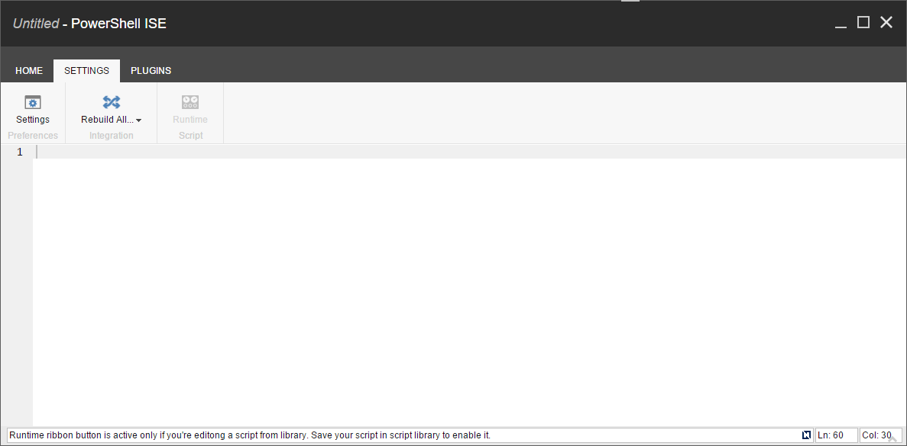

# Scripting

Once you move beyond running a single commands, you will begin to combine those into scripts for automation.
The Integrated Scripting Environment (ISE) is a great way to group together commands and save for later use. The ISE is a beefed up version of the Console.

Here's a quick look at the ISE:

Now let's review each of the different features; take note of the numbered labels:

 1. The *Write* chunk:
  * New - Creates a new script or module.
  * Open - Opens an existing script for the library.
  * Save - Saves the current script to the library.
  * Save As - Creates a new copy of the current script to the library.
  * Reload - Opens the original copy of the current script without saving modification.
 2. The *Script* chunk:
  * Execute - Runs the current script as a background job or in the http context.
  * Abort - Stops the execution of an executing script.
  * Runtime
 3. The *Context* chunk:
  * Context - Specifies the current item in the script. Often denoted as a *.* (dot) or *$pwd* (present working directory).
  * Session - Specifies the session to use when executing the script. Resused sessions live in the *HttpSession*.
 4. The *Text* area:
  * This is where you type all the commands for the script.
 5. The *Output* pane:
  * This is where you see the output of your script.
 6. The *Settings* tab:
  * This is for the other ribbon options.
 7. The *Tips* strip:
  * This is where you find helpful shortcuts.
 8. The *Line* and *Column* indicator:
  * This indicates the current position of the cursor.
 9. The *Splitter* strip:
  * This is where you change the height of the output pane.
 10. The *Preferences* chunk:
  * Settings - Specifies the console, ise, and results look and behave.
 11. The *Integration* chunk:
  * Rebuild All - Rebuilds the gutter, ribbon, and control panel integration.