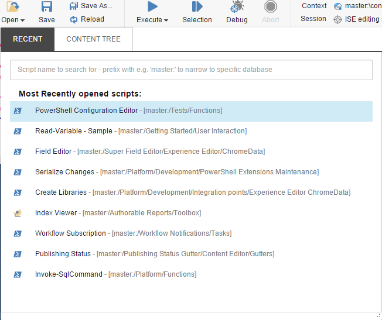

# Scripting

Once you move beyond running a single commands, you will begin to combine those into scripts for automation.
The Integrated Scripting Environment (ISE) is a great way to group together commands and save for later use. The ISE is a beefed up version of the Console.

Here's a quick look at the ISE:

 1. **Write**:
  * New - Creates a new script or module.
  * Open - Opens an existing script for the library.
  * Save - Saves the current script to the library.
  * Save As - Saves a copy of the current script to the library.
  * Reload - Opens the original copy of the current script without saving any modifications.
 2. **Script**:
  * Execute - Runs the current script as a background job or in the http context.
  * Abort - Stops the execution of an executing script.
  * Runtime
 3. **Context**:
  * Context - Specifies the current item in the script. Often denoted as a *.* (dot) or *$pwd* (present working directory).
  * Session - Specifies the session to use when executing the script. Reused sessions live in the *HttpSession*.
 4. **Script**:
  * This is where you type all the commands for the script.
 5. **Output**:
  * This is where you see the output of your script.
 6. The Home and Settings tabs.
 7. **Tips**:
  * This is where you find helpful shortcuts.
 8. **Line** and **Column**:
  * This indicates the current position of the cursor.
 9. **Splitter**:
  * This is where you change the height of the output pane.
 10. **Preferences**:
  * Settings - Specifies the console, ise, and results look and behave.
 11. **Integration**:
  * Rebuild All - Rebuilds the gutter, ribbon, and control panel integration.
 
The *Open* dialog provides both a search and tree view of the scripts stored in the script libraries. 

### Shortcuts
Below are the shortcuts available in the console.

| Shortcut  | Usage |
| --------  | ----- |
| TAB       | Indent |
| Ctrl-Space       | Autocomplete commands. Use the up or down direction keys to cycle through options.  |
| Ctrl-Enter | Displays the command help window. |
| Ctrl-Z | Undo the previous change. |
| Ctrl-Alt-Shift +  | Increase the font size |
| Ctrl-Alt-Shift -  | Decrease the font size |
| Ctrl-E | Executes the script |
| Alt-E | Executes the selected text in the script |
| Ctrl-Shift-E | Aborts the running script |
| Ctrl-F | Search for keywords in the script |

For more commands built into the script editor see [here][1]

[1]: https://github.com/ajaxorg/ace/wiki/Default-Keyboard-Shortcuts